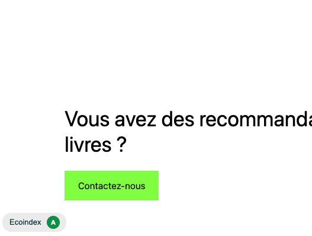
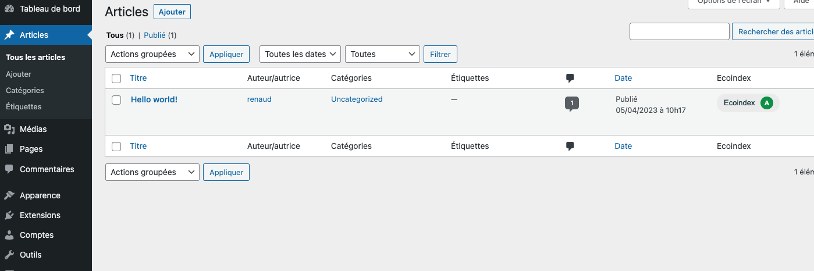
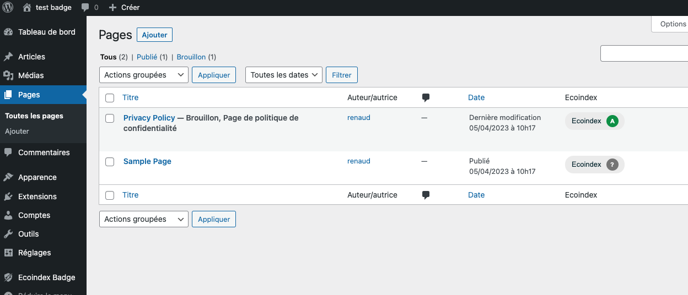
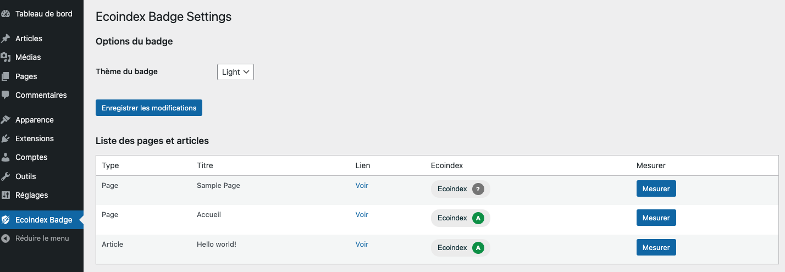

# Ecoindex Badge for WordPress

Version 1.2.8

Updated 2023-05-24

L'extension permet d'afficher le badge écoindex du GreenIT en bas de page.

Elle permet aussi de visualiser ses notes dans le backoffice :

- Dans la liste des articles ;
- Dans la liste des pages ;
- Dans un récap des pages dans la page de gestion du plugin.

[CHANGELOG](./CHANGELOG.md)

## Installation

Comme d'habitude

## Utilisation

### (v1.2.0)

- Dans chaque page en front, le badge est visible dans la barre d'administration (si connecté) et permet au survol de faire apparaitre un bouton permettant de lancer la mesure.

### (v1.1.0)

- Dès que l'extension est activée, le plugin est visible en bas de toutes les pages.
- Dans la backoffice du site, une page de configuration est ajoutée et permet de sélectionner le thème du badge à utiliser `dark` or `light`. (v1.1.0)
- Vous retrouvez dans cette page des boutons mesurer qui déclanche l'API et la mesure. L'API n'est pas instantannée...

## Visuels

### Badge dans les pages

### Badge dans la liste des articles

### Badge dans la liste des pages

### Page de configuration de l'extension

